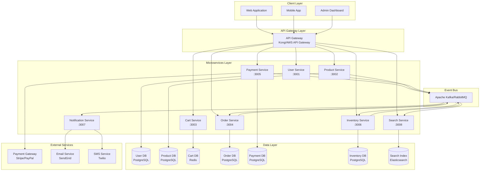

# E-Commerce Microservices Architecture

## Executive Summary

This document outlines a scalable e-commerce microservices architecture designed for a team of 5-8 developers, capable of handling 10,000+ concurrent users with real-time inventory management, secure payment processing, and multi-currency support.

## Architecture Principles

- **Service Independence**: Each service owns its data and business logic
- **Event-Driven Communication**: Asynchronous messaging for loose coupling
- **Database Per Service**: Independent data stores for autonomy
- **API Gateway Pattern**: Single entry point for client requests
- **Horizontal Scalability**: Stateless services that can scale independently
- **Security First**: Defense in depth with multiple security layers

## High-Level Architecture Diagram

## System Capacity Planning

### Target Performance Metrics

| Metric | Target | Strategy |
|--------|--------|----------|
| Concurrent Users | 10,000+ | Horizontal pod autoscaling |
| API Response Time | <200ms (p95) | Caching, optimized queries |
| Order Processing | 1000 orders/min | Async processing with queue |
| Payment Processing | <3 seconds | Dedicated payment service |
| Inventory Updates | Real-time | Event-driven updates |
| Availability | 99.9% | Multi-zone deployment |

### Scaling Strategy

- **Read-Heavy Services** (Product, Search): 3-10 replicas with read replicas
- **Write-Heavy Services** (Order, Inventory): 2-5 replicas with write optimization
- **Stateless Services**: All services designed for horizontal scaling
- **Database Scaling**: Read replicas, connection pooling, caching

## Team Structure Recommendation

For 5-8 developers:

1. **Team 1 (2 developers)**: User Service, Auth, API Gateway
2. **Team 2 (2 developers)**: Product Service, Inventory Service, Search Service
3. **Team 3 (2 developers)**: Order Service, Payment Service
4. **Team 4 (1-2 developers)**: Cart Service, Notification Service, Infrastructure/DevOps

## Next Steps

1. Review service boundaries and responsibilities
2. Examine database designs for each service
3. Understand inter-service communication patterns
4. Review technology stack recommendations
5. Plan deployment and scaling strategies

---

See detailed documentation:
- [Service Definitions](./SERVICE_DEFINITIONS.md)
- [Database Schemas](./DATABASE_SCHEMAS.md)
- [Communication Patterns](./COMMUNICATION_PATTERNS.md)
- [Technology Stack](./TECHNOLOGY_STACK.md)
- [Data Flow Diagrams](./DATA_FLOWS.md)
- [Deployment Guide](./DEPLOYMENT_GUIDE.md)
