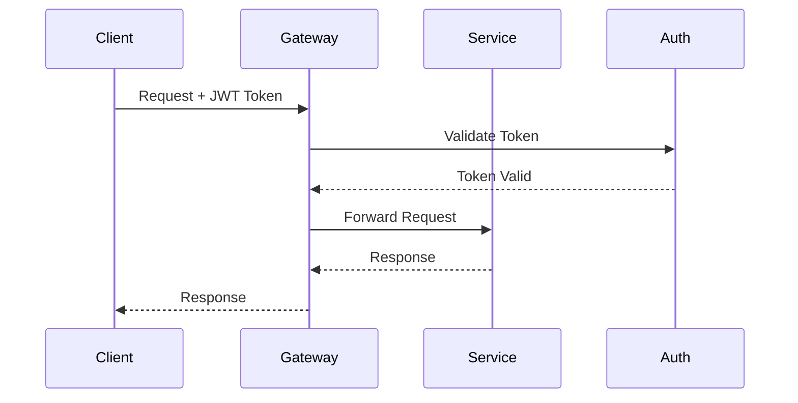
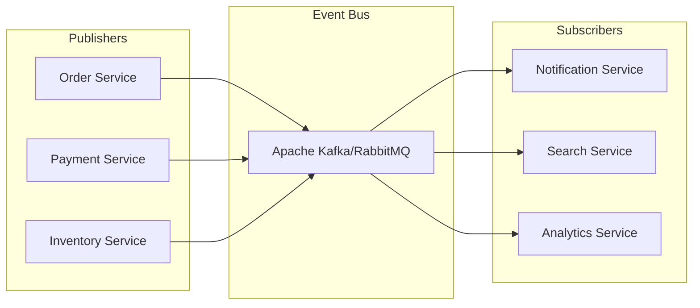
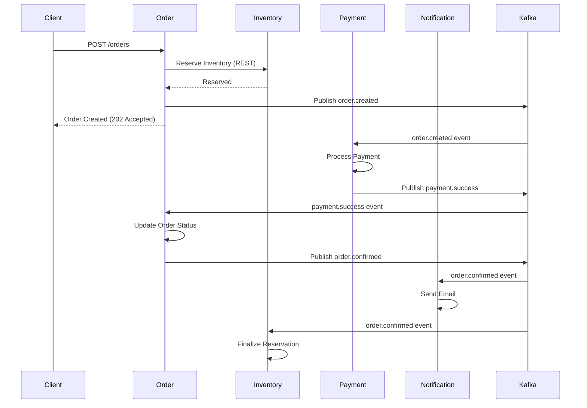
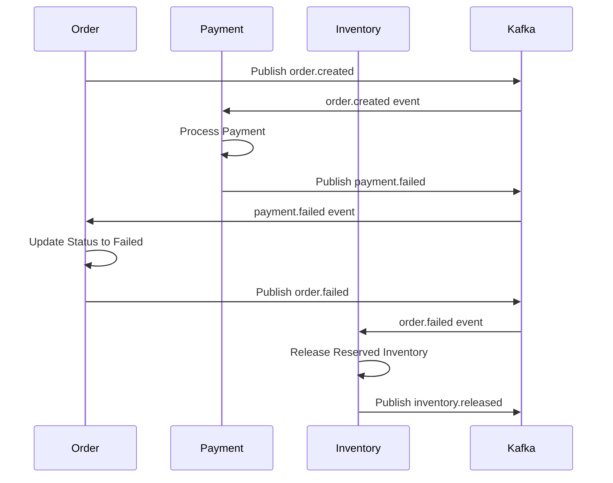

# Inter-Service Communication Patterns

## Communication Strategy Overview

The architecture uses a **hybrid approach**:
- **Synchronous (REST)**: For immediate consistency requirements
- **Asynchronous (Events)**: For loose coupling and scalability

---

## 1. Synchronous Communication (REST)

### When to Use REST
- Need immediate response
- Query operations (GET requests)
- Simple request-response workflows
- Low latency requirements

### API Gateway Pattern



### REST Communication Examples

#### Example 1: Get Product Details
```http
GET /api/products/{id}
Authorization: Bearer {jwt_token}

Response:
{
  "id": "uuid",
  "name": "Product Name",
  "price": 29.99,
  "currency": "USD",
  "in_stock": true
}
```

#### Example 2: Add Item to Cart
```http
POST /api/cart/items
Authorization: Bearer {jwt_token}
Content-Type: application/json

{
  "product_id": "uuid",
  "variant_id": "uuid",
  "quantity": 2
}

Response:
{
  "cart_id": "uuid",
  "items": [...],
  "total": 59.98
}
```

### Circuit Breaker Pattern

Prevent cascading failures when services are down:

```javascript
// Pseudo-code for circuit breaker
class CircuitBreaker {
  constructor(service, threshold = 5, timeout = 60000) {
    this.state = 'CLOSED'; // CLOSED, OPEN, HALF_OPEN
    this.failureCount = 0;
    this.threshold = threshold;
    this.timeout = timeout;
  }

  async call(request) {
    if (this.state === 'OPEN') {
      if (Date.now() - this.lastFailureTime > this.timeout) {
        this.state = 'HALF_OPEN';
      } else {
        throw new Error('Circuit breaker is OPEN');
      }
    }

    try {
      const response = await service.call(request);
      this.onSuccess();
      return response;
    } catch (error) {
      this.onFailure();
      throw error;
    }
  }

  onSuccess() {
    this.failureCount = 0;
    this.state = 'CLOSED';
  }

  onFailure() {
    this.failureCount++;
    if (this.failureCount >= this.threshold) {
      this.state = 'OPEN';
      this.lastFailureTime = Date.now();
    }
  }
}
```

### Retry Strategy

```javascript
async function retryWithBackoff(fn, maxRetries = 3) {
  for (let i = 0; i < maxRetries; i++) {
    try {
      return await fn();
    } catch (error) {
      if (i === maxRetries - 1) throw error;
      
      const delay = Math.min(1000 * Math.pow(2, i), 10000);
      await sleep(delay);
    }
  }
}
```

---

## 2. Asynchronous Communication (Events)

### When to Use Events
- Don't need immediate response
- Multiple services need to react to same event
- Eventual consistency is acceptable
- Decoupling services

### Event-Driven Architecture



### Event Schema Standard

All events follow this structure:

```json
{
  "event_id": "uuid",
  "event_type": "order.created",
  "event_version": "1.0",
  "timestamp": "2024-01-15T10:30:00Z",
  "source_service": "order-service",
  "correlation_id": "uuid",
  "data": {
    // Event-specific payload
  },
  "metadata": {
    "user_id": "uuid",
    "trace_id": "uuid"
  }
}
```

### Event Types and Flows

#### 1. Order Creation Flow



#### 2. Payment Failure Flow (Saga Pattern)



### Event Examples

#### Event: `order.created`
```json
{
  "event_id": "550e8400-e29b-41d4-a716-446655440000",
  "event_type": "order.created",
  "event_version": "1.0",
  "timestamp": "2024-01-15T10:30:00Z",
  "source_service": "order-service",
  "correlation_id": "550e8400-e29b-41d4-a716-446655440001",
  "data": {
    "order_id": "550e8400-e29b-41d4-a716-446655440002",
    "order_number": "ORD-2024-00001",
    "user_id": "550e8400-e29b-41d4-a716-446655440003",
    "total": 59.98,
    "currency": "USD",
    "items": [
      {
        "product_id": "550e8400-e29b-41d4-a716-446655440004",
        "quantity": 2,
        "price": 29.99
      }
    ],
    "shipping_address": {
      "address_line1": "123 Main St",
      "city": "San Francisco",
      "state": "CA",
      "postal_code": "94105",
      "country": "US"
    }
  },
  "metadata": {
    "user_id": "550e8400-e29b-41d4-a716-446655440003",
    "trace_id": "550e8400-e29b-41d4-a716-446655440005"
  }
}
```

#### Event: `payment.success`
```json
{
  "event_id": "650e8400-e29b-41d4-a716-446655440000",
  "event_type": "payment.success",
  "event_version": "1.0",
  "timestamp": "2024-01-15T10:30:05Z",
  "source_service": "payment-service",
  "correlation_id": "550e8400-e29b-41d4-a716-446655440001",
  "data": {
    "payment_id": "650e8400-e29b-41d4-a716-446655440001",
    "order_id": "550e8400-e29b-41d4-a716-446655440002",
    "transaction_id": "TXN-2024-00001",
    "amount": 59.98,
    "currency": "USD",
    "payment_method": "credit_card",
    "provider": "stripe",
    "provider_transaction_id": "ch_3ABC123"
  },
  "metadata": {
    "user_id": "550e8400-e29b-41d4-a716-446655440003",
    "trace_id": "550e8400-e29b-41d4-a716-446655440005"
  }
}
```

#### Event: `inventory.reserved`
```json
{
  "event_id": "750e8400-e29b-41d4-a716-446655440000",
  "event_type": "inventory.reserved",
  "event_version": "1.0",
  "timestamp": "2024-01-15T10:29:58Z",
  "source_service": "inventory-service",
  "correlation_id": "550e8400-e29b-41d4-a716-446655440001",
  "data": {
    "reservation_id": "750e8400-e29b-41d4-a716-446655440001",
    "order_id": "550e8400-e29b-41d4-a716-446655440002",
    "reservations": [
      {
        "product_id": "550e8400-e29b-41d4-a716-446655440004",
        "quantity": 2,
        "warehouse_id": "850e8400-e29b-41d4-a716-446655440000"
      }
    ],
    "expires_at": "2024-01-15T10:44:58Z"
  },
  "metadata": {
    "user_id": "550e8400-e29b-41d4-a716-446655440003",
    "trace_id": "550e8400-e29b-41d4-a716-446655440005"
  }
}
```

---

## 3. Saga Pattern Implementation

### Choreography Saga (Event-Driven)

Each service listens to events and publishes new events. No central coordinator.

**Advantages:**
- Loose coupling
- Services are autonomous
- Easy to add new steps

**Disadvantages:**
- Harder to track overall flow
- Complex error handling

### Orchestration Saga (Coordinator)

A central orchestrator manages the saga workflow.

**Advantages:**
- Clear workflow visibility
- Easier error handling
- Centralized retry logic

**Disadvantages:**
- Single point of failure
- Orchestrator can become complex

### Example: Order Saga (Choreography)

```javascript
// Order Service - Saga Start
class OrderService {
  async createOrder(orderData) {
    // 1. Validate order
    const order = await this.validateAndCreateOrder(orderData);
    
    // 2. Publish event
    await eventBus.publish({
      event_type: 'order.created',
      data: order
    });
    
    return { order_id: order.id, status: 'pending' };
  }

  // Listen to payment events
  async onPaymentSuccess(event) {
    const { order_id } = event.data;
    await this.updateOrderStatus(order_id, 'confirmed');
    
    await eventBus.publish({
      event_type: 'order.confirmed',
      data: { order_id }
    });
  }

  async onPaymentFailed(event) {
    const { order_id } = event.data;
    await this.updateOrderStatus(order_id, 'failed');
    
    await eventBus.publish({
      event_type: 'order.failed',
      data: { order_id }
    });
  }
}

// Payment Service - Saga Participant
class PaymentService {
  async onOrderCreated(event) {
    const { order_id, total, currency } = event.data;
    
    try {
      const payment = await this.processPayment(total, currency);
      
      await eventBus.publish({
        event_type: 'payment.success',
        data: { order_id, payment_id: payment.id }
      });
    } catch (error) {
      await eventBus.publish({
        event_type: 'payment.failed',
        data: { order_id, reason: error.message }
      });
    }
  }
}

// Inventory Service - Saga Participant
class InventoryService {
  async onOrderCreated(event) {
    const { order_id, items } = event.data;
    
    try {
      await this.reserveInventory(order_id, items);
      
      await eventBus.publish({
        event_type: 'inventory.reserved',
        data: { order_id }
      });
    } catch (error) {
      await eventBus.publish({
        event_type: 'inventory.reservation.failed',
        data: { order_id, reason: error.message }
      });
    }
  }

  async onOrderFailed(event) {
    const { order_id } = event.data;
    await this.releaseInventory(order_id);
    
    await eventBus.publish({
      event_type: 'inventory.released',
      data: { order_id }
    });
  }
}
```

---

## 4. Event Bus Configuration

### Apache Kafka Setup

```yaml
# Topic Configuration
topics:
  - name: order-events
    partitions: 6
    replication_factor: 3
    retention_ms: 604800000 # 7 days
    
  - name: payment-events
    partitions: 6
    replication_factor: 3
    retention_ms: 2592000000 # 30 days
    
  - name: inventory-events
    partitions: 6
    replication_factor: 3
    retention_ms: 604800000 # 7 days
    
  - name: notification-events
    partitions: 3
    replication_factor: 3
    retention_ms: 86400000 # 1 day

# Consumer Groups
consumer_groups:
  - name: payment-service-group
    topics: [order-events]
    
  - name: notification-service-group
    topics: [order-events, payment-events, inventory-events]
    
  - name: search-service-group
    topics: [product-events, inventory-events]
```

### RabbitMQ Setup (Alternative)

```yaml
# Exchange Configuration
exchanges:
  - name: order.exchange
    type: topic
    durable: true
    
  - name: payment.exchange
    type: topic
    durable: true
    
  - name: inventory.exchange
    type: topic
    durable: true

# Queue Configuration
queues:
  - name: payment.order.queue
    durable: true
    bindings:
      - exchange: order.exchange
        routing_key: order.created
        
  - name: notification.order.queue
    durable: true
    bindings:
      - exchange: order.exchange
        routing_key: order.*
      - exchange: payment.exchange
        routing_key: payment.*
```

---

## 5. Idempotency and Exactly-Once Processing

### Idempotency Key Pattern

```javascript
class PaymentService {
  async processPayment(paymentData, idempotencyKey) {
    // Check if we've already processed this request
    const existingPayment = await this.db.findByIdempotencyKey(idempotencyKey);
    
    if (existingPayment) {
      // Return cached result
      return existingPayment;
    }
    
    // Process payment
    const payment = await this.performPayment(paymentData);
    payment.idempotency_key = idempotencyKey;
    
    await this.db.save(payment);
    return payment;
  }
}

// Client-side usage
const idempotencyKey = uuidv4();
await fetch('/api/payments/process', {
  method: 'POST',
  headers: {
    'Idempotency-Key': idempotencyKey
  },
  body: JSON.stringify(paymentData)
});
```

### Event Deduplication

```javascript
class EventConsumer {
  constructor() {
    this.processedEvents = new Set(); // Use Redis in production
  }

  async handleEvent(event) {
    // Check if event already processed
    if (this.processedEvents.has(event.event_id)) {
      console.log('Event already processed, skipping');
      return;
    }
    
    try {
      await this.processEvent(event);
      
      // Mark as processed
      this.processedEvents.add(event.event_id);
      
      // In production, store in Redis with TTL
      await redis.setex(
        `processed:${event.event_id}`,
        86400, // 24 hours
        'true'
      );
    } catch (error) {
      // Handle error, potentially retry
      throw error;
    }
  }
}
```

---

## 6. Service Discovery

### Service Registry Pattern

```javascript
// Service Registration
class ServiceRegistry {
  async register(serviceName, serviceUrl, healthCheckUrl) {
    await redis.hset('services', serviceName, JSON.stringify({
      url: serviceUrl,
      healthCheck: healthCheckUrl,
      lastSeen: Date.now()
    }));
    
    // Set TTL and require periodic heartbeat
    await redis.expire(`service:${serviceName}`, 30);
  }

  async discover(serviceName) {
    const service = await redis.hget('services', serviceName);
    return JSON.parse(service);
  }

  async getHealthyServices(serviceName) {
    const services = await this.getAll(serviceName);
    
    const healthChecks = await Promise.all(
      services.map(s => this.checkHealth(s))
    );
    
    return services.filter((s, i) => healthChecks[i]);
  }
}
```

### Kubernetes Service Discovery

```yaml
# Service definition
apiVersion: v1
kind: Service
metadata:
  name: product-service
spec:
  selector:
    app: product-service
  ports:
    - protocol: TCP
      port: 3002
      targetPort: 3002
  type: ClusterIP

# Access from other services
http://product-service.default.svc.cluster.local:3002
```

---

## 7. API Gateway Configuration

### Kong Gateway Example

```yaml
services:
  - name: user-service
    url: http://user-service:3001
    routes:
      - name: user-routes
        paths:
          - /api/users
        methods:
          - GET
          - POST
          - PUT
          - DELETE
    plugins:
      - name: jwt
      - name: rate-limiting
        config:
          minute: 100
          
  - name: product-service
    url: http://product-service:3002
    routes:
      - name: product-routes
        paths:
          - /api/products
    plugins:
      - name: cors
      - name: rate-limiting
        config:
          minute: 1000
      - name: response-cache
        config:
          content_type:
            - application/json
          cache_ttl: 300
```

---

## 8. Monitoring and Tracing

### Distributed Tracing

```javascript
// Using OpenTelemetry
const { trace, context } = require('@opentelemetry/api');

async function handleOrderCreation(orderData) {
  const tracer = trace.getTracer('order-service');
  
  return tracer.startActiveSpan('create-order', async (span) => {
    try {
      span.setAttribute('order.total', orderData.total);
      span.setAttribute('order.currency', orderData.currency);
      
      const order = await createOrder(orderData);
      
      // Propagate trace context in events
      await eventBus.publish({
        event_type: 'order.created',
        data: order,
        metadata: {
          trace_id: span.spanContext().traceId,
          span_id: span.spanContext().spanId
        }
      });
      
      span.setStatus({ code: SpanStatusCode.OK });
      return order;
    } catch (error) {
      span.recordException(error);
      span.setStatus({ code: SpanStatusCode.ERROR });
      throw error;
    } finally {
      span.end();
    }
  });
}
```

### Health Check Endpoints

```javascript
// Standard health check endpoint for all services
app.get('/health', async (req, res) => {
  const health = {
    status: 'healthy',
    timestamp: new Date().toISOString(),
    service: 'order-service',
    version: '1.0.0',
    checks: {
      database: await checkDatabase(),
      eventBus: await checkEventBus(),
      externalServices: await checkExternalServices()
    }
  };
  
  const isHealthy = Object.values(health.checks).every(c => c === 'ok');
  
  res.status(isHealthy ? 200 : 503).json(health);
});
```

---

## Communication Best Practices

### 1. Timeouts
- **REST calls**: 5-10 seconds
- **Event processing**: 30 seconds
- **Payment processing**: 30 seconds

### 2. Retry Policies
- **Exponential backoff**: Start with 1s, max 10s
- **Max retries**: 3 attempts
- **Retry only idempotent operations**

### 3. Error Handling
- **Graceful degradation**: Fallback to cached data
- **Circuit breakers**: Prevent cascading failures
- **Dead letter queues**: Capture failed events

### 4. Data Consistency
- **Strong consistency**: Use REST for critical operations
- **Eventual consistency**: Use events for most operations
- **Saga pattern**: For distributed transactions

### 5. Versioning
- **API versioning**: `/api/v1/orders`
- **Event versioning**: `event_version` field in events
- **Backward compatibility**: Support multiple versions
