# Data Flow Diagrams

## Overview

This document details the data flows for key user journeys and system operations in the e-commerce platform.

---

## 1. User Registration Flow

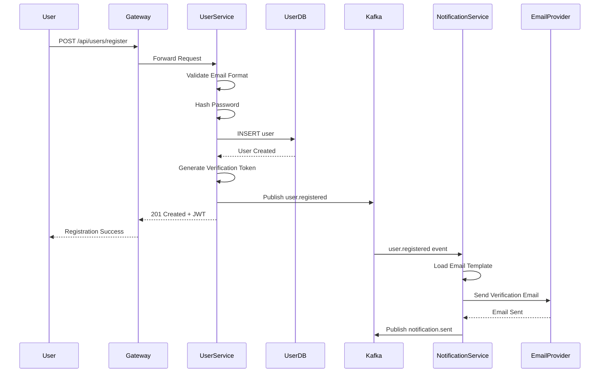

**Data Transferred:**
- **Request**: Email, password, first name, last name, phone
- **Response**: User ID, JWT token, refresh token
- **Event**: User details, verification token

**Error Scenarios:**
- Email already exists → 409 Conflict
- Invalid email format → 400 Bad Request
- Database failure → 503 Service Unavailable

---

## 2. User Login Flow

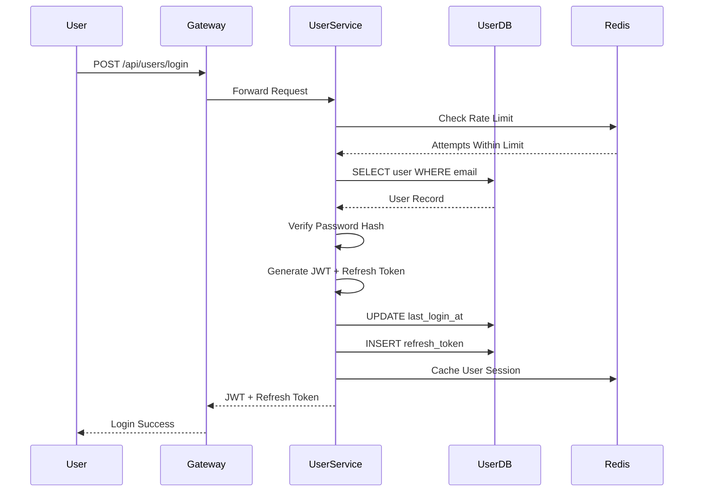

**Data Transferred:**
- **Request**: Email, password
- **Response**: JWT (access token), refresh token, user profile
- **Cached**: User session in Redis (15 min TTL)

**Security Features:**
- Rate limiting: 5 attempts per 15 minutes
- Password hashing: bcrypt with 12 rounds
- Token expiry: JWT (15 min), Refresh token (30 days)

---

## 3. Browse Products Flow

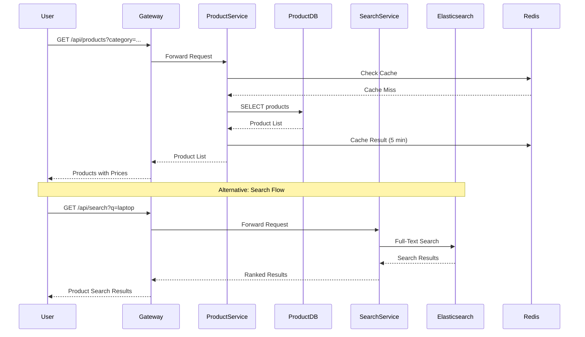

**Data Transferred:**
- **Request**: Category, filters (price range, brand, etc.), pagination
- **Response**: Product list with ID, name, price, images, ratings
- **Cached**: Product lists (5 min), individual products (15 min)

**Performance Optimizations:**
- Redis caching for hot products
- Elasticsearch for search (sub-second response)
- CDN for product images
- Pagination (20 items per page)

---

## 4. Add to Cart Flow

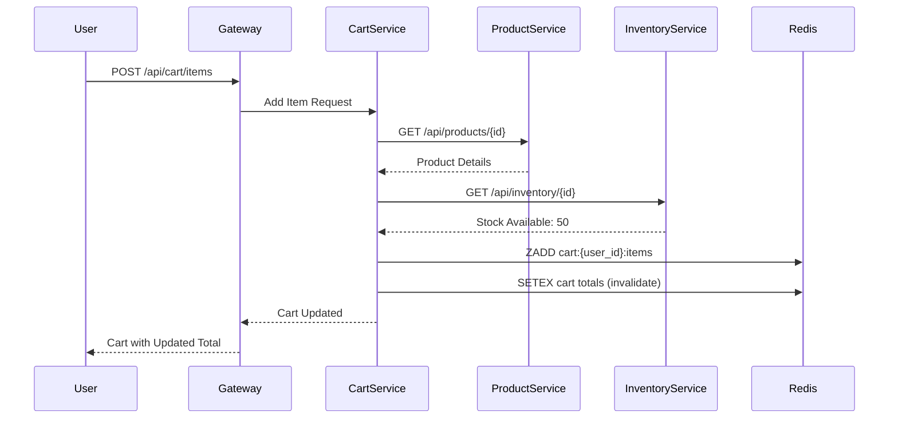

**Data Transferred:**
- **Request**: Product ID, variant ID (optional), quantity
- **Response**: Updated cart with items, subtotal, total
- **Stored in Redis**: Cart items, metadata, applied coupons

**Business Rules:**
- Verify product availability before adding
- Store price snapshot at time of addition
- Maximum 10 items per product
- Cart expires after 7 days

---

## 5. Checkout and Order Creation Flow

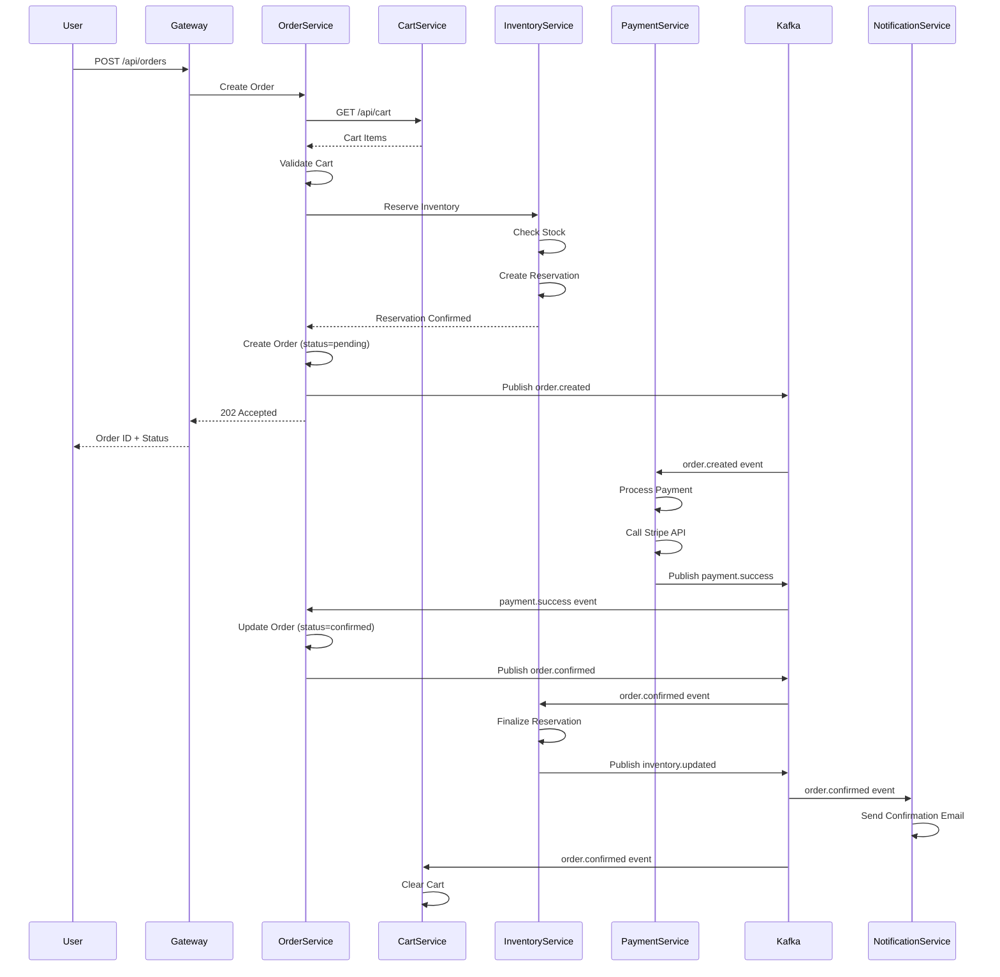

**Data Transferred:**
- **Order Creation**: User ID, cart items, shipping address, billing address
- **Inventory Reservation**: Product IDs, quantities, warehouse ID
- **Payment Processing**: Amount, currency, payment method
- **Notifications**: Order details, customer email

**Key Features:**
- **Idempotency**: Duplicate requests return same order
- **Timeout Handling**: Inventory reservations expire in 15 minutes
- **Atomic Operations**: Database transactions for order creation
- **Saga Orchestration**: Event-driven compensation on failures

---

## 6. Payment Processing Flow

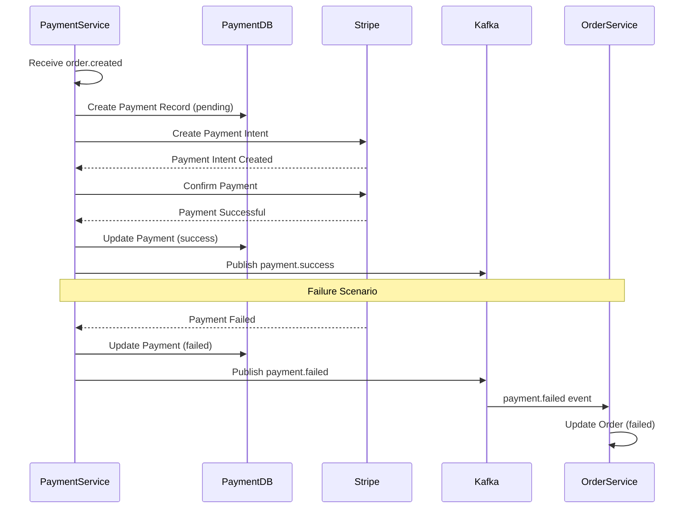

**Data Transferred:**
- **To Stripe**: Amount, currency, payment method token, idempotency key
- **From Stripe**: Transaction ID, status, failure reason
- **Stored**: Payment record, transaction ID, audit log

**Security Measures:**
- PCI DSS compliance (no raw card data stored)
- Tokenization via Stripe
- Idempotency keys prevent duplicate charges
- 3D Secure authentication support
- Fraud detection integration

---

## 7. Inventory Management Flow

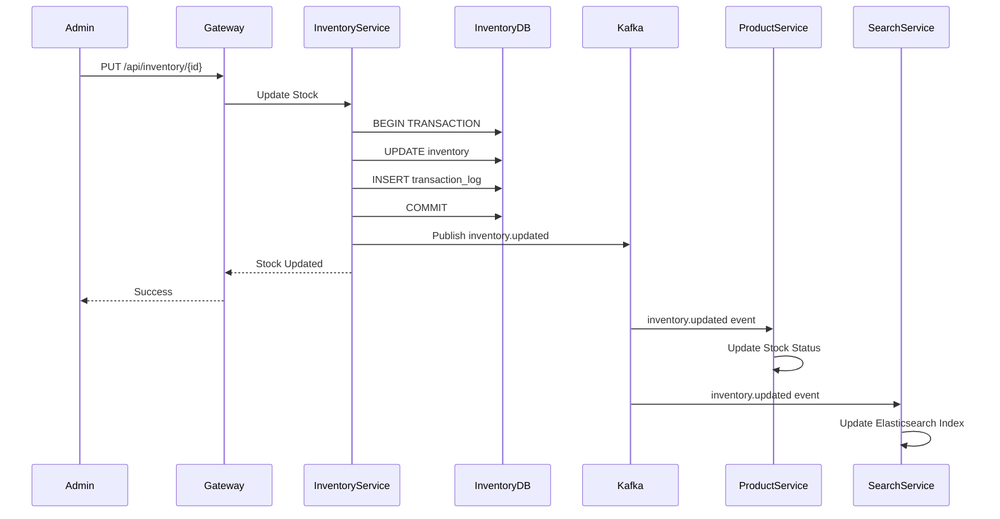

**Data Transferred:**
- **Request**: Product ID, quantity change, reason, warehouse ID
- **Response**: Updated stock levels
- **Event**: Product ID, new quantity, warehouse ID

**Features:**
- **Transaction Log**: Complete audit trail
- **Low Stock Alerts**: Automatic notifications when below threshold
- **Multi-Warehouse**: Track stock across multiple locations
- **Reservation System**: Prevent overselling during checkout

---

## 8. Product Search Flow

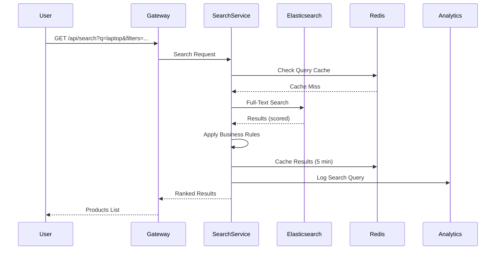

**Search Query Example:**
```json
{
  "query": {
    "bool": {
      "must": [
        {
          "multi_match": {
            "query": "laptop",
            "fields": ["name^3", "description", "category^2"],
            "type": "best_fields"
          }
        }
      ],
      "filter": [
        { "range": { "price": { "gte": 500, "lte": 1500 } } },
        { "term": { "in_stock": true } },
        { "terms": { "brand": ["Dell", "HP"] } }
      ]
    }
  },
  "sort": [
    { "_score": "desc" },
    { "rating": "desc" }
  ],
  "size": 20,
  "from": 0
}
```

**Features:**
- **Autocomplete**: Edge n-grams for suggestions
- **Faceted Search**: Filter by category, price, brand, etc.
- **Relevance Tuning**: Boost title matches over description
- **Typo Tolerance**: Fuzzy matching for misspellings

---

## 9. Order Cancellation Flow (Compensating Transaction)

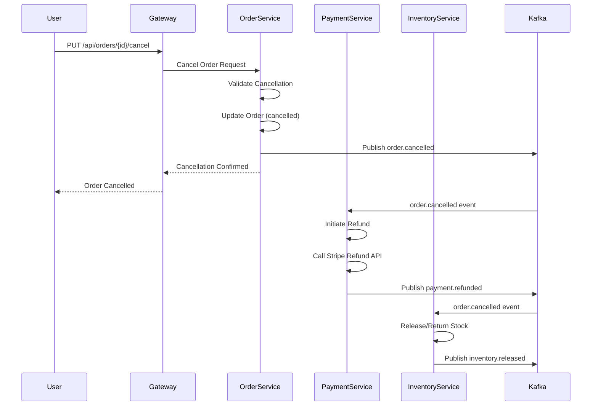

**Business Rules:**
- Can cancel if order status is "pending" or "confirmed"
- Cannot cancel if status is "shipped" or "delivered"
- Refund processed within 5-10 business days
- Inventory automatically restored

---

## 10. Admin Dashboard Data Flow

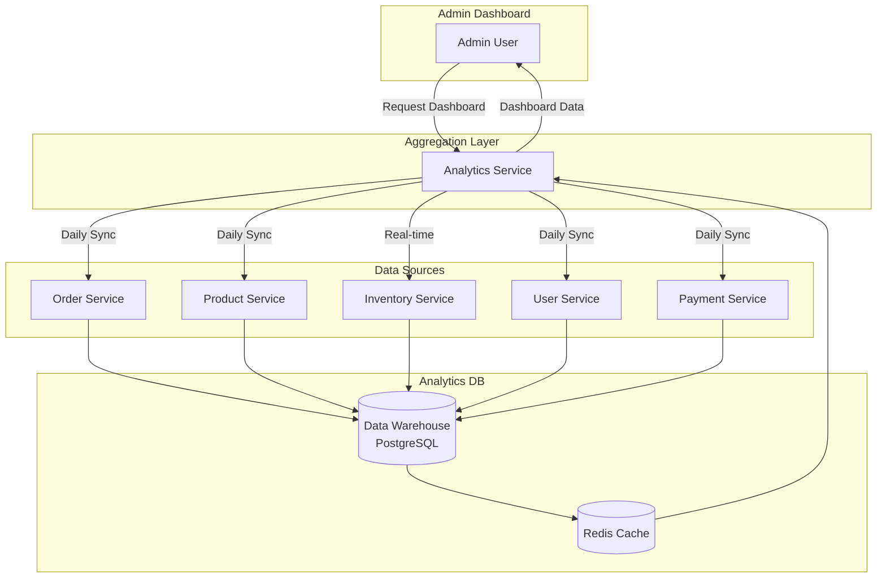

**Dashboard Metrics:**
- **Real-time**: Current orders, inventory levels, active users
- **Daily**: Revenue, orders, new customers
- **Weekly**: Top products, conversion rates
- **Monthly**: Revenue trends, customer retention

**Data Aggregation Strategy:**
- **ETL Pipeline**: Nightly batch jobs aggregate data
- **Caching**: Dashboard data cached for 5 minutes
- **Read Replicas**: Analytics queries use read-only replicas

---

## 11. Multi-Currency Pricing Flow

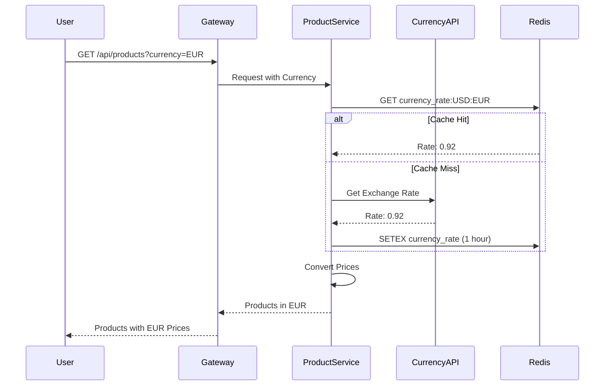

**Supported Currencies:**
- USD, EUR, GBP, CAD, AUD, JPY, CNY, INR

**Conversion Strategy:**
- Base currency: USD
- Exchange rates cached for 1 hour
- Rates fetched from external API (e.g., exchangerate-api.com)
- Prices rounded to 2 decimal places

---

## 12. Notification Flow

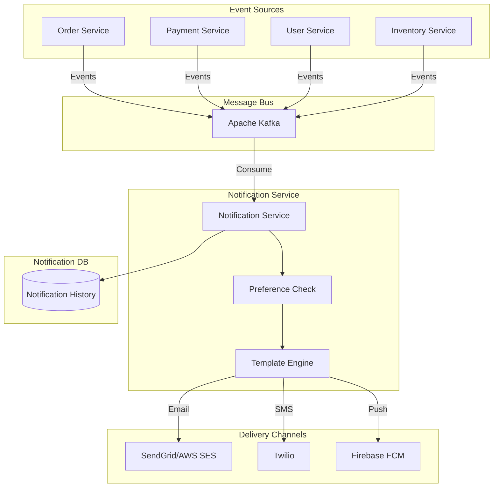

**Notification Types:**

| Event | Channel | Template | Priority |
|-------|---------|----------|----------|
| User Registered | Email | welcome_email | Medium |
| Order Created | Email | order_confirmation | High |
| Payment Success | Email | payment_receipt | High |
| Order Shipped | Email + SMS | shipment_notification | High |
| Order Delivered | Email | delivery_confirmation | Medium |
| Password Reset | Email | password_reset | High |
| Low Stock Alert | Email (Admin) | low_stock_alert | High |

**Delivery SLA:**
- Critical (Password reset, Payment): < 1 minute
- High (Orders, Shipments): < 5 minutes
- Medium (Newsletters, Promotions): < 1 hour

---

## 13. Real-Time Inventory Updates

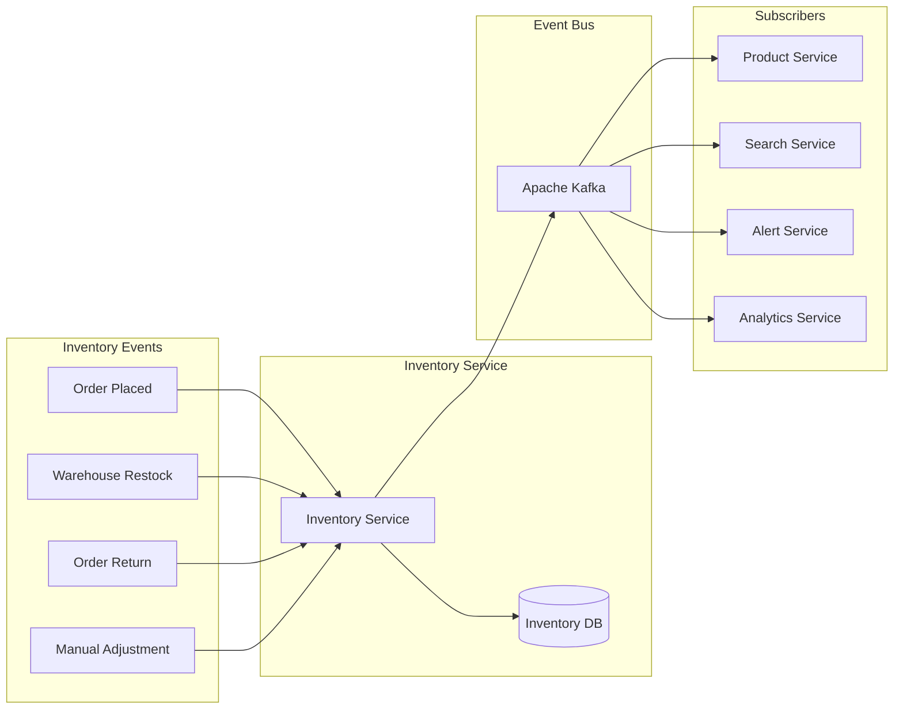

**Update Frequency:**
- **Order Placement**: Immediate (< 100ms)
- **Warehouse Restock**: Batch updates every 5 minutes
- **Returns**: Immediate upon return approval
- **Search Index**: Async update within 30 seconds

---

## Data Flow Performance Metrics

| Flow | Target Time | Caching | Database Operations |
|------|-------------|---------|---------------------|
| User Registration | < 500ms | - | 1 INSERT |
| User Login | < 200ms | Redis (session) | 2 SELECT, 1 UPDATE, 1 INSERT |
| Browse Products | < 100ms | Redis (5 min) | 1 SELECT |
| Product Search | < 200ms | Redis (5 min) | Elasticsearch query |
| Add to Cart | < 150ms | Redis (write-through) | Redis operations |
| Checkout | < 2s | - | Multiple services |
| Payment Processing | < 3s | - | External API + DB writes |
| Order Confirmation | < 5s (async) | - | Event-driven |

---

## Data Consistency Guarantees

### Strong Consistency (Synchronous)
- **User Authentication**: Must be immediately consistent
- **Payment Processing**: Must be immediately consistent
- **Inventory Reservation**: Must be immediately consistent

### Eventual Consistency (Asynchronous)
- **Search Index Updates**: Eventually consistent (< 30s)
- **Analytics Data**: Eventually consistent (< 5 min)
- **Notification Delivery**: Eventually consistent (< 5 min)
- **Cache Invalidation**: Eventually consistent (< 1 min)

### Conflict Resolution
- **Last Write Wins**: For user profile updates
- **Version Vectors**: For inventory updates
- **Saga Pattern**: For distributed transactions (order creation)
